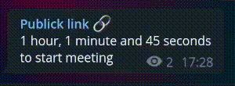

# countdown-vi

This is a telegram bot which programed to countdown.

## Usage

Well, first you should specify a exact interval.

There is 5 column, very first three columns represent a time interval, and last two column represent for a messaga and a channel id.

The channel-id use for sending the countdown to, and the countdown message will edit each 30 second until it reach to zero;

```
#hour:minute:second:message:@channelID
```

### Example

1. to countdown for 1 hour and 30 minute and 59 second
	- `1:30:59:to start meeting:@channelID`

2. to countdown for 30 minute:
	- `0:30:0:until new year:@channelID`

3. you can just specify a second, to be more *on time*
	- `0:0:3600:to lunch the project:@channelID`

### Preview



## Installing

You can activate your virtualenv and:

```bash
$ pip install -r requirements.txt
```

### Deploy

You can simply deploy this bot, just get a token from [*@BotFather*](https://t.me/BotFather) and put the token in the `main.py` file at the `token` variable.
